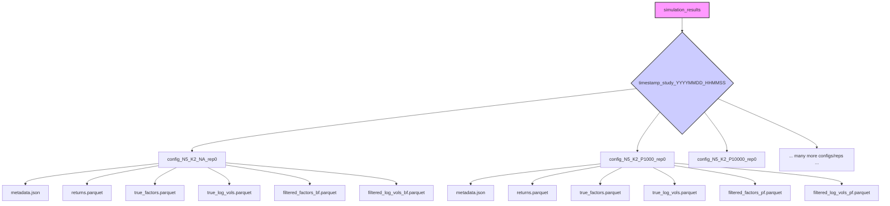

# Plan: Expand Simulation Study (`scripts/simulation_study.py`)

**Goal:** Significantly expand the simulation study defined in `scripts/simulation_study.py`. This involves broadening parameter ranges, increasing granularity and replicates, potentially adding new scenarios, and ensuring efficient, structured saving of raw results (excluding analysis/visualization).

**Based on Analysis of `scripts/simulation_study.py` (as of 2025-04-01 01:15):**

*   The script currently iterates through configurations, runs simulations, calculates *aggregated* accuracy/timing metrics, and saves only these aggregated metrics to a single CSV, along with summary plots.
*   It **does not** save the raw simulated time series or raw filtered state time series.

**Proposed Plan:**

**Phase 1: Refactoring for Raw Data Output and Flexibility**

1.  **Configuration Management:**
    *   Move simulation parameters (`N_values`, `K_values`, `T`, `num_particles_values`, `num_reps`) from hardcoded lists in `main` to a structured configuration dictionary/object.
    *   Define output directory structure clearly (e.g., using `pathlib`).

2.  **Modify `run_single_simulation`:**
    *   **Return Raw Data:** Change the function to return key raw NumPy arrays:
        *   `returns` (T, N)
        *   `true_factors` (T, K)
        *   `true_log_vols` (T, K)
        *   `filtered_factors_bf` (T, K) (if BF run)
        *   `filtered_log_vols_bf` (T, K) (if BF run)
        *   `filtered_factors_pf` (T, K) (if PF run)
        *   `filtered_log_vols_pf` (T, K) (if PF run)
    *   **Keep Metrics Calculation:** Retain calculation of RMSE/Correlation per run, returned alongside raw data.

3.  **Modify `main` Loop for Saving:**
    *   **Iterate and Execute:** Keep loops iterating through configurations and replicates.
    *   **Call `run_single_simulation`:** Execute the modified function.
    *   **Create Output Subdirectory:** For *each individual simulation run*, create a unique subdirectory (e.g., `results_dir / timestamp_study / config_N{N}_K{K}_P{P}_rep{rep} /`).
    *   **Save Raw Data:** Inside the unique subdirectory:
        *   Save raw NumPy arrays using an efficient format (e.g., `.npz` with compression, Parquet recommended for scalability, or HDF5).
        *   Save configuration parameters and scalar metrics (RMSE, Corr, time, error) for the run into a metadata file (e.g., `metadata.json` or `metrics.csv`).
    *   **Remove Aggregation/Plotting:** Delete or comment out Pandas DataFrame aggregation and Plotly plotting code.

**Phase 2: Expanding the Study**

1.  **Update Configuration:** Modify the configuration dictionary/object to include:
    *   Broader ranges and increased granularity for `N_values`, `K_values`.
    *   Substantially increased `num_reps`.
    *   More `num_particles_values`.
    *   (Optional) Variations for `T`.
    *   (Optional) Specific parameter scenarios (e.g., high/low persistence) instead of purely random generation.

**Phase 3: Execution and Verification**

1.  **Resource Planning:** Acknowledge significant computation time and disk space requirements.
2.  **Testing:** Run the refactored script with a minimal configuration to verify the saving structure.
3.  **Full Execution:** Run the script with the expanded configuration.
4.  **Output Verification:** Check the output directory structure and confirm raw data and metadata files are created correctly per run.

**Proposed Output Structure Visualization:**

**Next Step:** Switch to `code` mode to implement these changes in `scripts/simulation_study.py`.