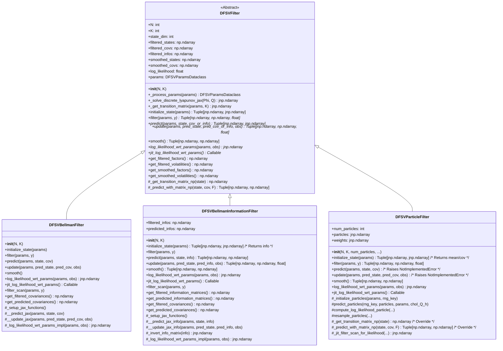

# Filter API Alignment and Refactoring Plan

**Date:** 2025-06-04

**Goal:** Refactor the DFSV filter classes (`DFSVBellmanFilter`, `DFSVBellmanInformationFilter`, `DFSVParticleFilter`) to ensure a consistent API inherited from `DFSVFilter`, implement missing base class methods, align method signatures, and update tests and usage examples accordingly.

**Context:** This refactoring aims to improve code consistency and maintainability across the different filter implementations within the `bellman_filter_dfsv` project. It builds upon previous refactoring efforts (e.g., JIT compatibility, BIF stabilization).

## I. Goal Details

*   Ensure all three filter classes inherit consistently from `DFSVFilter`.
*   Implement any abstract/missing methods from `DFSVFilter` in each subclass, respecting their specific paradigms (covariance, information, particles).
*   Align the signatures and return types of core methods (`initialize_state`, `filter`, `predict`, `update`, `smooth`, `log_likelihood_wrt_params`, `jit_log_likelihood_wrt_params`) across subclasses where applicable and meaningful.
*   Rename the existing `log_likelihood_of_params` method in subclasses to `log_likelihood_wrt_params` for clarity and add it (and `jit_log_likelihood_wrt_params`) as abstract methods to the base class.

## II. Analysis Summary (Informed by Memory Bank)

*   **Base Class (`DFSVFilter`):** Defines the core interface. `filter`, `predict`, `update`, `log_likelihood_wrt_params`, `jit_log_likelihood_wrt_params` require subclass implementation. `smooth` has a base RTS implementation.
*   **`DFSVBellmanFilter`:** Needs `smooth` implementation (call super) and `log_likelihood_of_params` rename (plus `jit_` version).
*   **`DFSVBellmanInformationFilter`:** Needs `initialize_state_info` -> `initialize_state`, public `predict`/`update` wrappers, `smooth` implementation (info->cov then super), `log_likelihood_of_params` rename (plus `jit_` version).
*   **`DFSVParticleFilter`:** Needs standard `initialize_state`, internal `_initialize_particles` rename, public `predict`/`update` raising `NotImplementedError`, rename smoother helpers (`_np` suffix), `smooth` implementation (call super), `log_likelihood_of_params` rename (plus `jit_` version).

## III. Proposed Refactoring Steps

1.  **Base Class (`src/bellman_filter_dfsv/core/filters/base.py`) Changes:**
    *   Update docstrings for `initialize_state`, `predict`, `update` to clarify potential covariance/information matrix variations.
    *   Add abstract method definition: `def log_likelihood_wrt_params(self, params: DFSVParamsDataclass, observations: jnp.ndarray) -> jnp.ndarray: raise NotImplementedError(...)`.
    *   Add abstract method definition: `def jit_log_likelihood_wrt_params(self) -> Callable: raise NotImplementedError(...)`.
    *   Ensure `smooth` method correctly calls `_get_transition_matrix_np` and `_predict_with_matrix_np`.

2.  **Bellman Information Filter (`src/bellman_filter_dfsv/core/filters/bellman_information.py`) Changes:**
    *   Rename `initialize_state_info` -> `initialize_state`. Update internal calls.
    *   Add public `predict(self, params, state, info)` method (wraps `__predict_jax_info`, handles NumPy/JAX conversion).
    *   Add public `update(self, params, predicted_state, predicted_info, observation)` method (wraps `__update_jax_info`, handles NumPy/JAX conversion).
    *   Implement `smooth(self)`: Check `self.filtered_infos`, convert to `self.filtered_covs` via `get_filtered_covariances()`, call `super().smooth()`.
    *   Rename `log_likelihood_of_params` -> `log_likelihood_wrt_params`.
    *   Rename `jit_log_likelihood_of_params` -> `jit_log_likelihood_wrt_params`.
    *   Rename `_log_likelihood_of_params_impl` -> `_log_likelihood_wrt_params_impl`.

3.  **Particle Filter (`src/bellman_filter_dfsv/core/filters/particle.py`) Changes:**
    *   Add standard `initialize_state(self, params)` method (calls `super().initialize_state`).
    *   Rename internal `initialize_particles` -> `_initialize_particles`. Update `filter` method call.
    *   Add public `predict(self, params, state, cov)` method that raises `NotImplementedError`.
    *   Add public `update(self, params, predicted_state, predicted_cov, observation)` method that raises `NotImplementedError`.
    *   Rename smoother helper `_get_transition_matrix` -> `_get_transition_matrix_np`.
    *   Rename smoother helper `_predict_with_matrix` -> `_predict_with_matrix_np`.
    *   Implement `smooth(self)` method (calls `super().smooth()`).
    *   Rename `log_likelihood_of_params` -> `log_likelihood_wrt_params`.
    *   Rename `_jit_filter_scan` -> `_jit_filter_scan_for_likelihood`.
    *   Implement `jit_log_likelihood_wrt_params(self) -> Callable` (returns `_jit_filter_scan_for_likelihood`).

4.  **Bellman Filter (`src/bellman_filter_dfsv/core/filters/bellman.py`) Changes:**
    *   Implement `smooth(self)` method (calls `super().smooth()`).
    *   Rename `log_likelihood_of_params` -> `log_likelihood_wrt_params`.
    *   Rename `jit_log_likelihood_of_params` -> `jit_log_likelihood_wrt_params`.
    *   Rename `_log_likelihood_of_params_impl` -> `_log_likelihood_wrt_params_impl`.

5.  **Testing (`tests/`) Changes:**
    *   Review all test files (`test_*.py`).
    *   Update tests calling methods affected by API changes (e.g., `initialize_state`, `log_likelihood_wrt_params`, `jit_log_likelihood_wrt_params`).
    *   Adjust or remove tests calling `predict`/`update` on `DFSVParticleFilter`.
    *   Add tests for `smooth` implementations if needed.

6.  **Test Execution:**
    *   Run the full test suite using `uv run pytest`.
    *   Debug and fix any test failures.

7.  **Usage Analysis (`scripts/`, `examples/`):**
    *   Review scripts and examples using filter classes.
    *   Update method calls to match the new API.
    *   Ensure Particle Filter usage aligns with its supported methods.

## IV. Class Diagram

## V. Implementation Handoff

This plan outlines the necessary steps for refactoring. The implementation should now proceed, following these steps sequentially. As per `.clinerules`, switching to `boomerang` mode is recommended for orchestrating the implementation.