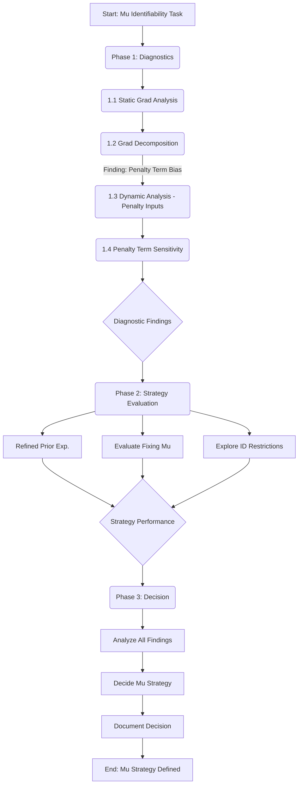

# Revised Plan: Diagnose Mu Estimation Bias & Finalize Handling Strategy

**Date:** 2025-06-04 (Updated 2025-06-04 v2)

**Goal:** Understand *why* the BIF pseudo-likelihood's **penalty term** causes a biased gradient signal for `mu`, and determine a robust strategy for handling `mu` (estimate with priors vs. fix value vs. structural restrictions).

**Context:**
*   Static Gradient Analysis (Phase 1.1) and Gradient Decomposition (Phase 1.2) revealed the KL-like penalty term is the primary source of the gradient bias pushing `mu` estimates higher than true values.
*   Previous experiments (`test_bif_identifiability_fix.py`, `test_bif_priors_optimizers.py`) also showed difficulty estimating `mu` without strong priors/constraints.
*   Resolving this is critical for applying the model to real data (Thesis Plan Task 1).

## Phase 1: Diagnostic Analysis (Understanding the Penalty Term's Role)

### **1.1** Static Gradient Analysis (Isolating `mu`) - COMPLETED

*   **Objective:** Analyze the gradient of the objective function w.r.t. `mu` *only*, keeping other parameters fixed at true values.
*   **Status:** Completed. Found gradient consistently negative, indicating bias.

### **1.2** Gradient Decomposition - COMPLETED

*   **Objective:** Calculate gradients of "fit" and "penalty" terms separately w.r.t `mu`.
*   **Status:** Completed. Confirmed the **penalty term** is the dominant source of the gradient bias.

### **1.3** Dynamic Analysis (Focus on Penalty Term Inputs) - NEXT STEP

*   **Objective:** Observe how the inputs to the penalty term calculation (`bif_likelihood_penalty_impl`) behave dynamically during optimization as `mu` drifts.
*   **Steps:**
    1.  **Add Debug Prints:** Use `jax.debug.print` within relevant JIT functions (esp. `__update_jax_info`, `bif_likelihood_penalty_impl`).
    2.  **Monitor Key Values (at each time `t`):**
        *   `a_pred` (predicted state, influenced by current `mu` estimate)
        *   `a_updated` (optimized state from `_block_coordinate_update_impl`)
        *   `diff = a_updated - a_pred` (especially the `h` component)
        *   `Omega_pred` (predicted information matrix)
        *   The final value of the quadratic term `diff.T @ Omega_pred @ diff` within `bif_likelihood_penalty_impl`.
    3.  **Run Optimization:** Execute test script optimization (e.g., AdamW, weak/no `mu` prior).
*   **Analysis:** How does the `mu`-influenced `diff` interact with `Omega_pred`? How does the quadratic term value change as the estimated `mu` drifts? Understand *why* this leads to the biased gradient contribution from the penalty.

### **1.4** Penalty Term Sensitivity

*   **Objective:** Isolate the penalty term's impact and test pragmatic solutions.
*   **Steps:**
    1.  **Penalty Ablation Test:** Temporarily modify `bif_likelihood_penalty_impl` to return 0. Re-run optimization. Does `mu` still trend upwards (guided only by fit term), or behave differently?
    2.  **Strong Priors Test:** Revisit using a strong prior centered correctly on `mu` (e.g., mean -1.0, small variance). Does this effectively constrain the estimate despite the underlying penalty term bias?

## Phase 2: Strategy Evaluation (Based on Diagnostic Findings)

*   **Objective:** Evaluate potential final strategies informed by the diagnostic phase.
*   **Actions (To be prioritized based on Phase 1 results):**
    *   **Refined Prior Experimentation:** If strong priors (from **1.4**) work pragmatically, refine prior choice.
    *   **Evaluate Fixing `mu`:** If diagnostics suggest estimation is fundamentally flawed, test fixing `mu`.
    *   **Explore Identification Restrictions:** If a structural fix seems plausible, test restrictions (e.g., `mu[0] = 0`).

## Phase 3: Decision & Documentation

1.  **Analyze All Findings:** Synthesize results from Phase 1 (Diagnostics) and Phase 2 (Strategies).
2.  **Decide Mu Strategy:** Select the most robust and practical strategy.
3.  **Document Decision:** Record the chosen strategy, rationale, and supporting evidence in `memory-bank/decisionLog.md`.

## Workflow Visualization (Updated Focus & Numbering)

## Next Steps

*   Proceed with implementation of this revised plan, starting with **Phase 1.3: Dynamic Analysis (Focus on Penalty Term Inputs)**.
*   Switch to an appropriate mode (e.g., Code, Boomerang) for execution.