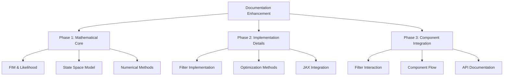
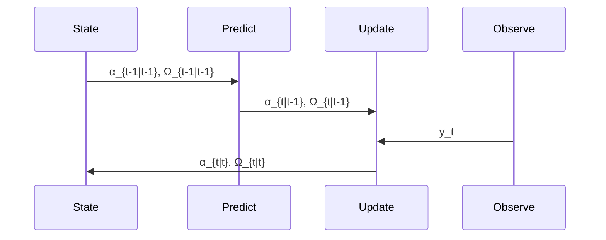
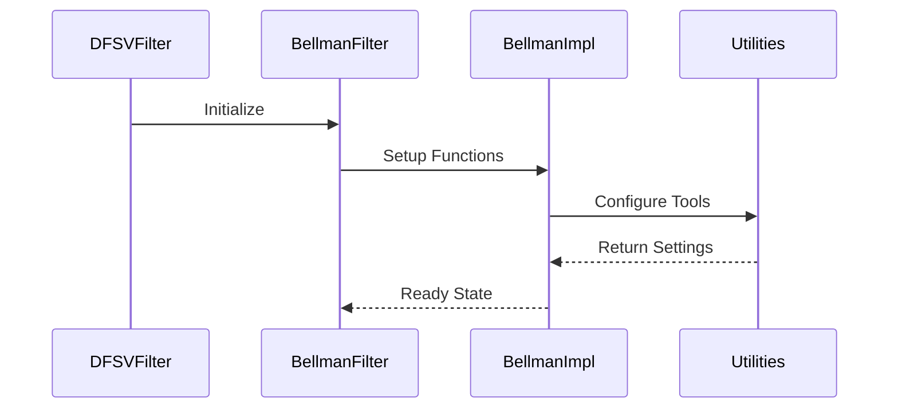

# Documentation Enhancement Plan (11-04-2025)

## Overview

This plan outlines the enhancement of documentation for the Bellman Information Filter (BIF) implementation, with a focus on mathematical foundations and clear component interaction descriptions.

## Phase 1: Mathematical Foundations (Priority)

### 1.1 Observed Fisher Information Matrix (`observed_fim_impl`)
- Full derivation of blocks 𝓘_ff, 𝓘_fh, 𝓘_hh
- Matrix calculus steps for computing derivatives
- Relationship to Hessian of log-likelihood
- Connection to score vector calculations
- Mathematical notation in LaTeX format

### 1.2 Log Posterior Implementation (`log_posterior_impl`)
- Complete derivation of log p(y_t | α_t)
- Matrix Determinant Lemma application
- Woodbury identity for efficient computation
- Connection to Kalman filter likelihood
- Relationship to BIF penalty term

### 1.3 BIF Likelihood Penalty (`bif_likelihood_penalty_impl`)
- Derivation from Lange (2024) Eq. 40
- KL divergence approximation details
- Information geometry perspective
- Connection to variational methods

## Phase 2: Implementation Details

### 2.1 State Space Representation

### 2.2 Filter Methods Documentation
- Prediction step mathematics and implementation
- Update step optimization
- Scan vs loop implementation differences
- JAX transformation handling

### 2.3 Numerical Considerations
- FIM eigenvalue clipping rationale
- Joseph form implementation details
- Regularization approaches
- JAX stability patterns

## Phase 3: Component Integration

### 3.1 Module-Level Documentation

### 3.2 API Documentation
- Common interface patterns
- Filter initialization flow
- Parameter handling
- State management

### 3.3 Testing & Validation
- Unit test coverage
- Numerical accuracy checks
- Performance considerations

## Implementation Strategy

1. Start with bellman_impl.py mathematical documentation
2. Clean up redundant comments while adding mathematical context
3. Add sequence diagrams to module documentation
4. Ensure consistent LaTeX notation throughout

## Documentation Standards

### Mathematical Notation
- Use LaTeX for equations
- Define all variables and parameters
- Include key references
- Maintain consistent notation

### Code Documentation
- Google style docstrings
- Clear parameter descriptions
- Mathematical background sections
- Cross-references to equations

### Component Integration
- Sequence diagrams for key flows
- Clear dependency documentation
- Performance considerations
- Error handling notes